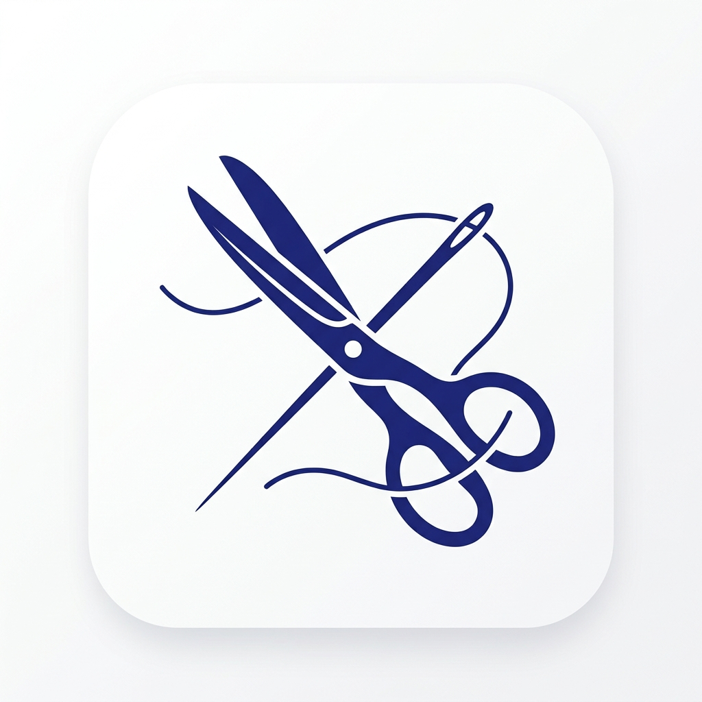
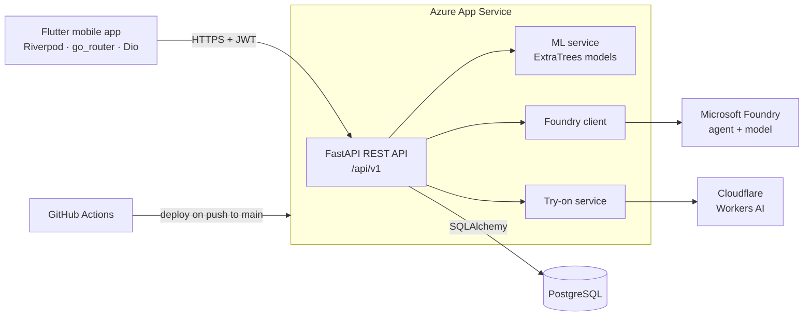
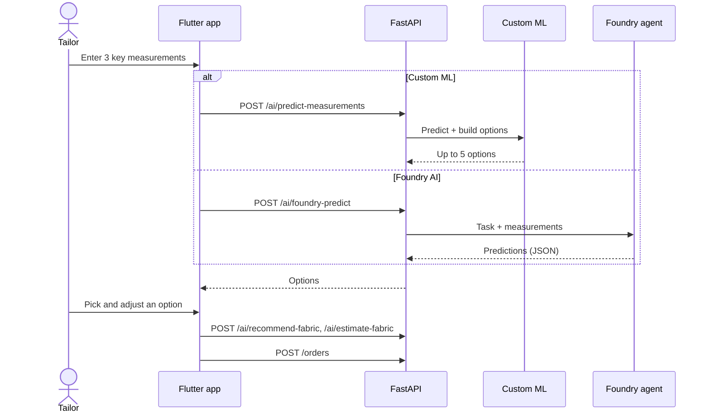
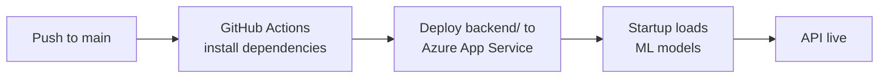

<div align="center">



# TailorSync

### AI-powered business management for tailoring shops

Measure less, predict more, and run the whole shop from one app.

[](https://flutter.dev)
[](https://fastapi.tiangolo.com)
[](https://www.python.org)
[](https://www.postgresql.org)
[](https://scikit-learn.org)
[](https://azure.microsoft.com)
[](#getting-started)
[](LICENSE)

[Overview](#overview) •
[Features](#features) •
[AI & ML](#ai--machine-learning) •
[Architecture](#architecture) •
[Getting started](#getting-started) •
[API](#api-reference) •
[Team](#team) •
[License](#license)

</div>

---

## Overview

Most tailoring shops still run on paper. Measurements sit in ledgers, order progress is tracked from memory, and fabric is bought by guesswork. The result is lost customer data, wasted cloth, late deliveries and no clear view of how the business is performing.

**TailorSync** brings the whole workflow into a single Android app for shop owners and their tailors, backed by a secure cloud API:

- A tailor takes **three key measurements**, and TailorSync **predicts the rest**.
- The app **recommends fabrics** for the occasion and weather and **estimates the metres** to buy.
- Orders move through a **clear production pipeline**, are **assigned to staff**, and feed **live reports**.

### Highlights

| | |
|---|---|
| **Dual prediction engine** | Choose our own trained ML models (instant, free, deterministic) or a Microsoft Foundry AI agent (all garment types) |
| **Options, not guesses** | The ML engine returns up to five ranked measurement options with a confidence-style support score |
| **Stock-aware fabric advice** | Recommended fabrics are matched to the shop's inventory in real time |
| **Built for the shop floor** | Material 3 design, responsive on every phone size, works for owners and staff with role-based access |
| **Cloud-native** | FastAPI on Azure App Service, PostgreSQL, CI/CD with GitHub Actions, Managed Identity for AI access |

<!--
## Screenshots

Add app screenshots to docs/screenshots/ and uncomment this section.

| Dashboard | New Order Wizard | AI Prediction | Reports |
|:---:|:---:|:---:|:---:|
|  |  |  |  |
-->

---

## Features

### For shop owners

| Module | Capabilities |
|---|---|
| **Dashboard** | Active, pending, overdue and completed orders at a glance, with staff workload |
| **Customers** | Customer profiles with saved measurements and full order history |
| **New Order Wizard** | Guided 9-step flow from customer to assigned order, with AI at every measuring and fabric step |
| **Staff management** | Invite, deactivate and remove staff; assign orders to specific tailors |
| **Inventory** | Fabric stock in metres, stock movements and low-stock alerts |
| **Reports** | KPIs, order trends, on-time delivery rate and per-staff performance |
| **Virtual try-on** | Generate a preview of the customer wearing a described garment |

### For tailors (staff)

| Module | Capabilities |
|---|---|
| **My tasks** | See assigned orders, due dates and priorities |
| **Order pipeline** | Move work through `Order Received → Cutting → Sewing → Fitting → Quality Check → Ready → Delivered` |
| **Measurements** | View and adjust measurements, including AI-suggested values |

### Platform

- **Authentication:** JWT access and refresh tokens, sign-up, password reset and reCAPTCHA-protected login
- **Role-based access:** separate owner and staff permissions
- **Email notifications:** finished orders, staff invitations and task assignments
- **Multi-tenant data:** every shop sees only its own customers, orders and staff

---

## AI & Machine Learning

TailorSync offers two independent engines. The tailor picks one in step 2 of the New Order Wizard.

| | **Custom ML** | **Microsoft Foundry AI** |
|---|---|---|
| Engine | scikit-learn ExtraTreesRegressor (300 trees) | Foundry agent `tailorsync-ai-agent`, GPT model fallback |
| Garments | Shirt, trouser | Shirt, trouser, dress, suit, jacket, coat, waistcoat, uniforms, traditional wear |
| Output | Up to 5 complete measurement options | Recommended value + alternatives per measurement |
| Speed and cost | Milliseconds, runs in the API, no usage cost | A few seconds, uses Azure AI credits |
| Behaviour | Deterministic and explainable | Generative, uses the attached datasets |

### Custom ML models

| Garment | Inputs (inches) | Predicted measurements |
|---|---|---|
| **Shirt** | Shoulder · Height (garment length) · Chest | Collar Size · Sleeve Open · Short Sleeve Length · Long Sleeve Length |
| **Trouser** | Height (garment length) · Waist · Seat | Height till Knee · Round Knee · Round End · Crotch |

**How the options are built**

1. **Central prediction:** the average of all 300 trees.
2. **Model modes:** the individual tree predictions are clustered with **KMeans**; each strong cluster (≥ 10 % of trees, within 1.5″ of the centre and at least 0.5″ different from other options) becomes an option with its **support %**.
3. **Similar records:** if fewer than five options remain, the nearest real training records are added under the same rules.

All values are snapped to the nearest **¼ inch**, as tailors measure, and inputs are validated against the ranges seen in training.

<details>
<summary><b>Example request and response</b></summary>

```http
POST /api/v1/ai/predict-measurements
Authorization: Bearer <token>
Content-Type: application/json

{ "garment_type": "shirt", "shoulder": 8, "height": 28, "chest": 40 }
```

```json
{
  "options": [
    {
      "option_number": 1,
      "source": "model_central",
      "support_percent": null,
      "measurements": {
        "collar_size": 15.5,
        "sleeve_open": 14.75,
        "short_sleeve_length": 19.5,
        "long_sleeve_length": 33.75
      }
    }
  ]
}
```

Further options use `"source": "model_mode"` (with a `support_percent`) or `"similar_record"`.

</details>

### Microsoft Foundry AI

- Calls a hosted **Foundry agent** with the garment datasets attached, authenticated with **Azure Managed Identity** (no keys in the app).
- Falls back automatically to a **GPT model deployment** with the relevant dataset supplied in the prompt.
- Powers **measurement prediction**, **fabric recommendation** (three fabrics with suitability scores and live stock) and **fabric estimation** (metres with a min–max range).
- Replies are parsed into strict JSON and validated with Pydantic; AI endpoints are **rate-limited per user**.

---

## Architecture



The mobile app only talks to the backend. AI credentials, trained models and database access never leave the server.

### AI prediction flow



---

## Tech stack

| Layer | Technologies |
|---|---|
| **Mobile** | Flutter · Dart · Riverpod · go_router · Dio · Material 3 · Google Fonts |
| **Backend** | Python 3.11 · FastAPI · Uvicorn · SQLAlchemy · Alembic · Pydantic · python-jose · Passlib |
| **Database** | PostgreSQL |
| **Machine learning** | scikit-learn · NumPy · joblib |
| **Cloud AI** | Microsoft Foundry · Azure AI Projects SDK · Azure AI Inference · Azure Identity |
| **Image AI** | Cloudflare Workers AI |
| **DevOps** | GitHub Actions · Azure App Service |

---

## Project structure

```
TailorSync/
├── backend/
│   ├── app/
│   │   ├── api/v1/routers/    REST endpoints (auth, customers, orders, ai, reports, …)
│   │   ├── services/          business logic, ml_service, foundry_client, dataset_service
│   │   ├── models/            SQLAlchemy models
│   │   ├── schemas/           Pydantic request and response schemas
│   │   └── main.py            entry point, model loading, /health
│   ├── models/                trained ML models (.joblib)
│   ├── data/                  garment measurement datasets (CSV)
│   ├── alembic/               database migrations
│   └── requirements.txt
├── frontend/flutter_app/
│   ├── lib/
│   │   ├── core/              API client, configuration, networking
│   │   ├── features/          screens grouped by feature
│   │   └── ui/                design system: theme, components, motion
│   └── test/                  widget tests
├── .github/workflows/         CI/CD pipeline
├── er_diagram.md              database diagram
├── USER_MANUAL.md             end-user guide
└── LICENSE
```

---

## Getting started

### Prerequisites

| Tool | Version |
|---|---|
| Flutter SDK | 3.x (with Android SDK, or a physical Android device) |
| Python | 3.11 |
| PostgreSQL | 14 or later |
| Azure CLI | Optional, for Foundry AI (`az login`) |

### 1. Clone

```bash
git clone https://github.com/Sandeepa-git/TailorSync.git
cd TailorSync
```

### 2. Backend

```bash
cd backend
python -m venv venv
# Windows: venv\Scripts\activate    macOS/Linux: source venv/bin/activate
pip install -r requirements.txt
```

Create `backend/.env` (see [Configuration](#configuration)), then:

```bash
alembic upgrade head
uvicorn app.main:app --host 0.0.0.0 --port 8000 --reload
```

| Check | URL |
|---|---|
| Health | `http://localhost:8000/health` |
| Interactive API docs | `http://localhost:8000/docs` |

### 3. Mobile app

```bash
cd frontend/flutter_app
flutter pub get
flutter run --dart-define=BACKEND_URL=http://10.0.2.2:8000/api/v1
```

> [!TIP]
> `10.0.2.2` points to your computer from the Android emulator. On a physical phone, use your computer's local IP address. Without `BACKEND_URL`, the app connects to the production API.

### 4. Build a release APK

```bash
flutter build apk --release
```

The APK is written to `build/app/outputs/flutter-apk/app-release.apk`.

---

## Configuration

Settings are read from environment variables: `backend/.env` locally, App Service configuration in Azure.

> [!IMPORTANT]
> Never commit `.env` files or real keys to the repository.

<details>
<summary><b>Environment variables</b></summary>

| Variable | Required | Purpose |
|---|:---:|---|
| `DATABASE_URL` | ✔ | PostgreSQL connection string |
| `SECRET_KEY` | ✔ | Secret used to sign JWT tokens |
| `FOUNDRY_PROJECT_ENDPOINT` | AI | Microsoft Foundry project endpoint (enables the agent) |
| `FOUNDRY_AGENT_NAME` | | Agent name (default `tailorsync-ai-agent`) |
| `FOUNDRY_AGENT_VERSION` | | Pin a specific agent version |
| `FOUNDRY_ENDPOINT` | AI | Fallback model endpoint |
| `FOUNDRY_API_KEY` | | Fallback model key (local development; Managed Identity in Azure) |
| `FOUNDRY_MODEL_NAME` | | Fallback model deployment (default `gpt-4o`) |
| `FOUNDRY_REASONING_EFFORT` | | Reasoning effort when overrides are allowed (default `low`) |
| `FOUNDRY_AGENT_OVERRIDES` | | Send reasoning and JSON-format options to the agent (default `false`) |
| `CF_ACCOUNT_ID`, `CF_API_TOKEN` | Try-on | Cloudflare Workers AI credentials |
| `SMTP_SERVER`, `SMTP_PORT`, `SMTP_USERNAME`, `SMTP_PASSWORD` | Email | Outgoing email |
| `RECAPTCHA_ENABLED`, `RECAPTCHA_SITE_KEY`, `RECAPTCHA_SECRET_KEY` | | Login bot protection |

</details>

---

## API reference

All routes are under `/api/v1`. Everything except sign-up and login requires `Authorization: Bearer <token>`.

| Group | Endpoints |
|---|---|
| **Auth** | `POST /auth/login` · `POST /auth/signup` · `POST /auth/refresh` · `GET /auth/verify` · password reset |
| **Customers** | create, list, view and update customers and their measurements |
| **Orders** | create (from the wizard), update status, assign staff |
| **Staff** | invite, list, deactivate and remove staff |
| **Inventory** | stock items, transactions, low-stock alerts |
| **Reports** | `GET /reports/overview` · `GET /reports/staff-performance` |
| **AI** | `GET /ai/input-ranges/{garment}` · `POST /ai/predict-measurements` · `POST /ai/foundry-predict` · `POST /ai/recommend-fabric` · `POST /ai/estimate-fabric` · `POST /ai/virtual-tryon` |

The complete, interactive reference is served by FastAPI at `/docs`.

---

## Testing

```bash
# Mobile app
cd frontend/flutter_app
flutter analyze
flutter test
```

```bash
# Backend: confirm the API and ML models are up
curl http://localhost:8000/health
```

---

## Deployment



- Workflow: `.github/workflows/main_tailorsync-api-prod.yml`
- Runtime: Python 3.11 on Azure App Service (Linux)
- AI access: App Service **Managed Identity** with a role on the Foundry project

> [!NOTE]
> The API is briefly unavailable while a deployment restarts the service. Turn on **Always On** in App Service to avoid slow first requests after idle periods.

---

## Security

- Passwords hashed with bcrypt; JWT-based sessions with refresh tokens
- reCAPTCHA on login to block automated attacks
- Owner and staff roles enforced on the server
- Per-user rate limiting on AI endpoints
- Azure Managed Identity for AI services, so no AI keys ship with the app
- Each shop's data is isolated by business

---

## Roadmap

- [ ] Store every AI prediction and the tailor's final values to measure accuracy and retrain
- [ ] Extend Custom ML to more garment types
- [ ] iOS release
- [ ] Offline mode with background sync
- [ ] Customer-facing order tracking

---

## Team

TailorSync was designed and built as a third-year university group project by:

<table>
  <tr>
    <td align="center"><b>A.G.S.V. Wimalasiri</b></td>
    <td align="center"><b>W.A.E.M. Wijayarathna</b></td>
    <td align="center"><b>N.D.H.A. Madubhashitha</b></td>
  </tr>
  <tr>
    <td align="center"><b>D.M.J.B. Disanayake</b></td>
    <td align="center"><b>Manuwendra Rajapaksha</b></td>
    <td align="center"><b>K.P.N.D. Ashokarathna</b></td>
  </tr>
</table>

### Acknowledgements

Built with [Flutter](https://flutter.dev), [FastAPI](https://fastapi.tiangolo.com), [scikit-learn](https://scikit-learn.org), [Microsoft Foundry](https://ai.azure.com) and [Cloudflare Workers AI](https://developers.cloudflare.com/workers-ai/).

---

## License

Copyright © 2026 The TailorSync Team. All rights reserved.

This project is **proprietary**. The source code is published for academic assessment and portfolio purposes only and may not be copied, modified, distributed or used commercially without written permission from the authors. See [LICENSE](LICENSE) for the full terms. Third-party libraries and services remain under their own licenses.

**Academic declaration:** this project is the original work of the team above. External libraries, frameworks and cloud APIs are used in line with their respective licenses and terms.

<div align="center">
<sub>© 2026 The TailorSync Team</sub>
</div>
